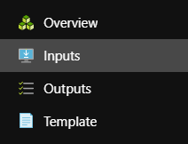

# Lab 7: Deploy a Personal Host Pool

Now that we have provisioned a Windows Virtual Desktop Tenant, we can now deploy a Personal Host Pool to publish resources to our users.

## Exercise 1 - Provision a Personal Host Pool

1. Return to the [Azure Portal](https://portal.azure.com) on your desktop and search for **Marketplace**.  
    > **NOTE:** Ensure that you are in the correct directory and subscription.

    

2. While in the **Marketplace** search for **Windows Virtual Desktop - Provision a host pool**

    

3. Select the **Windows Virtual Desktop - Provision a host pool** and then click the **Create** button to provision this service.

    

4. Complete the **Basics** tab with the following information and then click **Next: Configure virtual machines >**
    * Resource Group: *Create New* **WVDLab-Personal**
    * Region: **Choose the same region where you placed previous resources**
    * Hostpool name: **Personal**
    * Desktop type: **Personal**

5. Complete the **Configure virtual machines** tab with the following information and then click **Next: Virtual machine settings >**
    * Total users: **2**
        >This will create 2 hosts and join them to AD and this pool.
    * Virtual machine size: *Change Size* and select **B2s**
        >If B2s isn't available then choose the smallest VM size that is supported within your region such as a **D2s_v3**.
    * Virtual machine name prefix: **Personal**
        >This prefix will be used in combination with the VM number to create the VM name. If using 'Personal' as the prefix, VMs would be named 'Personal-0', 'Personal-1', etc. You should use a unique prefix to reduce name collisions in Active Directory and in Windows Virtual Desktop.

6. Complete the **Virtual machine settings** tab with the following information and then click **Next: Windows Virtual Desktop information >**
    * AD domain join UPN: `wvdadmin@yourADdomain.TLD`
        >UPN of an Active Directory user that has permissions and will be used to join the virtual machines to your domain.  If you didn't write this down you can return to your RDP session with the domain controller and obtain the information.
    * Admin Password: `Complex.Password`
    * Confirm password: `Complex.Password`
    * Virtual network: **Select AD-VNET, do not create a new VNET**.
    * vmSubnet: **Select AD-Subnet, do not create a new subnet**.

7. Complete the **Windows Virtual Desktop information** tab with the following information:
    * Windows Virtual Desktop tenant group name
        >**DO NOT CHANGE THIS NAME!**
    * Windows Virtual Desktop tenant name:  `<yourWVDTenantName>`
        >Provide the tenant name used earlier. If the name does not exactly match your deployment will fail.  If your PowerShell window is still open you should be able to retrieve the name there.
    * UPN: `WVDAdmin@<yourAzureADDomain>.onmicrosoft.com`
    * Password: `Complex.Password`
    * Confirm password: `Complex.Password`

8. Select **Review + Create**. Wait for a **Validation Passed** and if you get a failure examine the **Activity log** in the Azure portal and resolve the failure.

   

9. Select **Create** to start your Personal Host Pool deployment.

10. You can watch the progress of the deployment.  Note that this will take about 15 minutes or so to complete, so it might be a good time to stretch your virtual legs and take a break.

    
11. You should eventually receive a message **“Your Deployment is complete”.**

    

12. If your deployment fails, click on **Operation detail** to determine what failed.
    

13. You can click on **Inputs** to see if you had a typo or entered the wrong information.

    

>We often see students entering the wrong domain information and the domain join fails.  Reviewing the data on the inputs field can help you determine the root cause of the failure.

**Congrats! You have successfully deployed a Personal Host Pool!**

## Exercise 2 - Assign users to the Pool

Now use the following commands to ensure your users are a member of the Personal Host pool.

This cmd will ensure the user is a member of the Application Pool, this is required to have access to see the session host.

1. In the Azure Portal open Azure Active Directory for your tenant.
2. Select **Users** then **Bob Jones**.
3. Copy the UPN for Bob Jones.  e.g. `Bob.Jones@<yourAzureADdomain>.onmicrosoft.com`
4. Return to PowerShell on the domain controller, click on **New Script** and then cut, paste and edit the following command:

    ```Powershell
    Add-RdsAppGroupUser $TenantName -HostPoolName Personal -AppGroupName "Desktop Application Group" -UserPrincipalName Bob.Jones@<yourAzureADdomain>.onmicrosoft.com
    ```

5. Hit **Run Script (F5)**.

### Continue to Lab 8: [Deploy a Pooled Host Pool](Deploy-Lab08-Deploy-a-Pooled-Host-Pool.md)

### Return to [Deploy Phase Labs](deploy.md)
